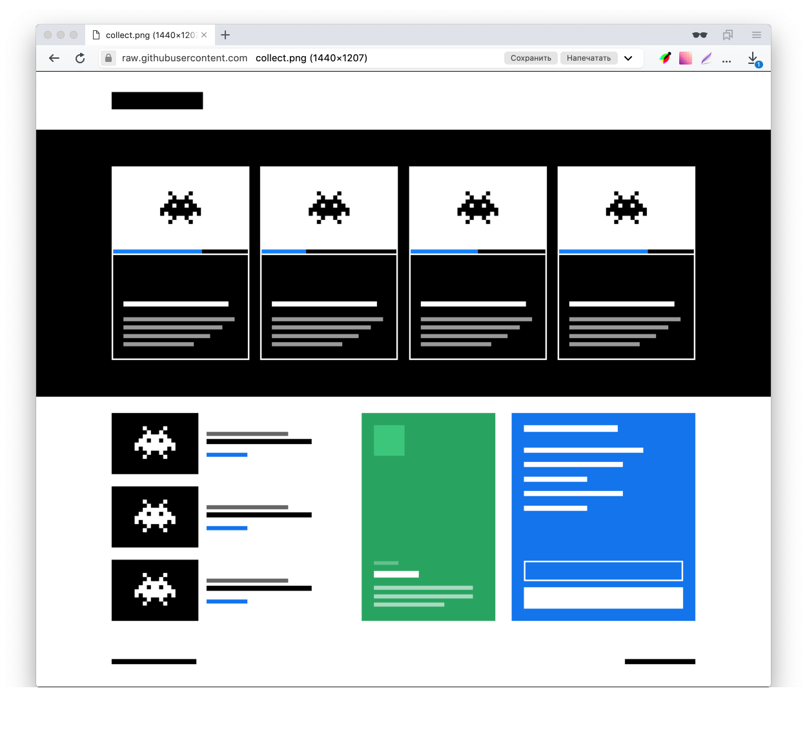

# Задание 1. Реализуйте дизайн-систему

В этом репозитории находятся материалы тестового задания «Реализуйте дизайн-систему» для [15-й Школы разработки интерфейсов](https://yandex.ru/promo/academy/shri) (осень 2019, Москва).

## Задание

Дизайн-система — это правила построения интерфейса. Благодаря им интерфейс будет консистентным и выглядеть органично. Вам нужно реализовать блоки дизайн-системы и написать функцию шаблонизации, которая соберет из этих блоков HTML страницы.

Дизайн-система, описанная в этом задании, предназначена для конструирования прототипов, в которых элементы интерфейса обозначены схематически, а вместо реальных данных — заглушки.



Правила дизайн-системы описываются в терминах методологии [БЭМ](https://ru.bem.info/methodology/key-concepts). Для обозначения сущностей интерфейса используется [соглашение по именованию](https://ru.bem.info/methodology/naming-convention).

### Что нужно сделать:

1. [Реализовать базовые блоки дизайн-системы](BASE.md)
2. [Реализовать контентные блоки](CONTENT.md)
3. [Написать функцию шаблонизации](TEMPLATER.md)
4. [Используя разные блоки собрать несколько страниц](PAGES.md)

### Результат

В качестве результата выполнения задания предоставьте исходный код и собранные бандлы с реализацией дизайн-системы.

В корне репозитория должен находиться каталог `/build` с файлами `style.css`, `script.js`, `template-engine.js`. Размер каждого файла — не более 1МБ.

- `style.css` — стили для всех блоков и модификаторов.
- `script.js` — код, который обеспечивает интерактивность блоков. Он будет запускаться один раз после загрузки страницы. События на блоках должны делегироваться в один обработчик на теге `<body>`.
- `template-engine.js` — функция шаблонизации.

  ```js
  /**
  * @param  {object} obj — Структура блоков интерфейса в формате BEMJSON
  * @return {string} HTML разметка страницы
  */
  export default function (obj) {
     // ...
  }
  ```

  Результирующая разметка должна содержать только контент страницы и не должна содержать тэги `html`, `head`, `body`.

